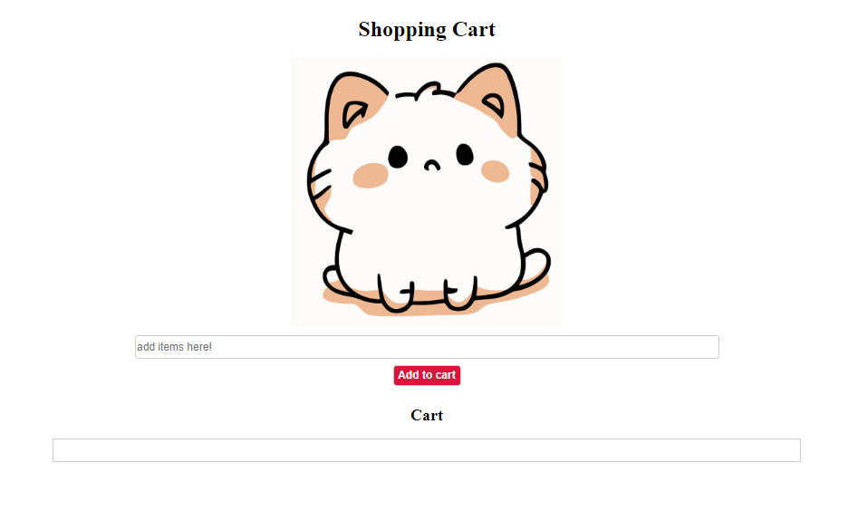

# Shopping Cart Application

This is a simple shopping cart application. By following the instructions below, you'll be able to build a web application where you can add items to a shopping cart. This project will test your basic knowledge of HTML, CSS, and JavaScript.

## Getting Started

1. As a user, I want to see the application name
2. As a user, I want to see an image of a cat
3. As a user, I want to input the name of an item so that I can add it to the cart.
4. As a user, I want a button to click so that I can add items to cart
5. As a user, I want to display the items inside the cart

## Optional
1. Clear cart
2. Use flex box inside cart

## Screenshot
